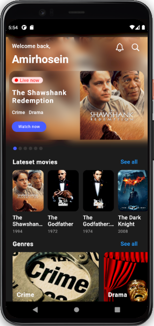
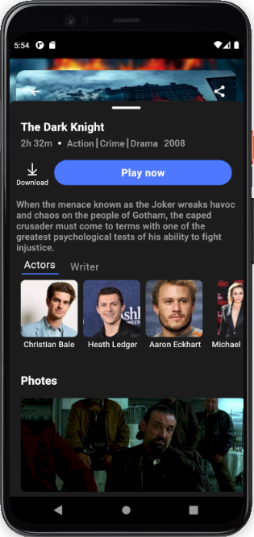
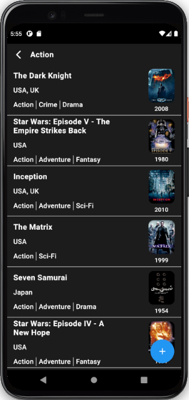
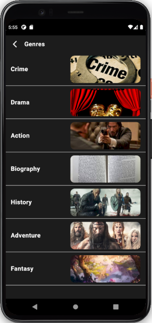
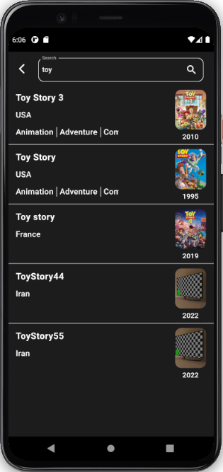
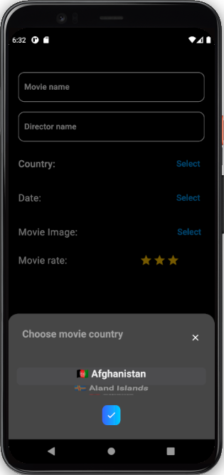
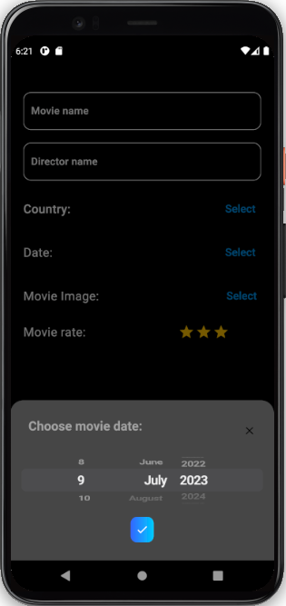

# movie_app

A movie app Project

Movie app project that connects to API and has list of movies, genres, search movie, and also movies in different genres.
This project is based on flutter_bloc(cubit) and retrofit as client manager (handle GET and POST methods).
You can create your movie  and upload image of movie in /screens/add_movie_page.dart and search it.

API link is:
http://moviesapi.ir/

The Design of the project is a dribbble shot(some additional pages have been designed by myself because those pages like genre list or latest movies or movie photos weren't on that dribble shot).

The design link is:
https://dribbble.com/shots/20285249-Movie-App-Exploration/attachments/15347450?mode=media

And last but not least, on the movie detail page you see 2 tabs(Actors and writers) that has a list of actors and writers, those actor and writer images are not real, and the list of images that placed in utils/image_list.dart file.

## Images:  

 
 
 
 
 
 
 
 

Hope you like it 🤗

Please press star button if you like it ❤️